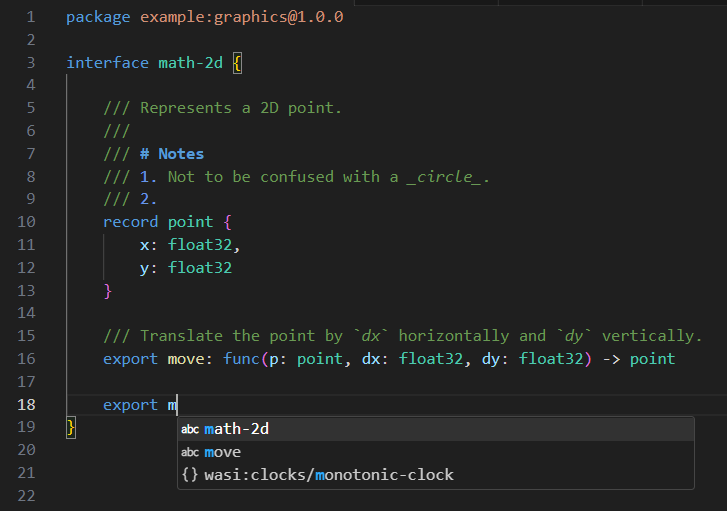

# WIT (WebAssembly Interface Types)

VS Code support for working with [WebAssembly Component Model Interface Type](https://github.com/WebAssembly/component-model/blob/main/design/mvp/WIT.md) files.

## Features:
- `*.wit` Syntax highlighting.
- Basic markdown highlighting in comments.
- Automatically continues doc-comments on next line.
- Simple list-based autocomplete of:
	- WIT keywords,
	- WIT builtin types,
	- Common WASI packages & interfaces



## Known issues

Due to the simplicity of the current lookahead scheme, there are some limitations:

### Braces, brackets & parentheses must open on the same line as the item they're opening.
✅ Works:

```wit
enum state {
	open,
	closed
}

export log: func(
	msg: string
) -> result<_ err>
```

❌ Broken:
```wit
enum state
{
	open,
	closed
}

export log: func
(
	msg: string
) -> result<_ err>
```

### Return type annotations must start on the same line as the closing parenthesis of the parameter list.
✅ Works:

```wit
export log: func(msg: string) -> result<_ err>

export magic: func(
	a: u32,
	b: u32
) -> (
	c: u32,
	d: u32
)
```

❌ Broken:
```wit
export log: func(msg: string)
	 -> result<_ err>

export magic: func(
	a: u32,
	b: u32
)
->
(
	c: u32,
	d: u32
)
```
